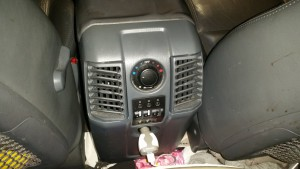
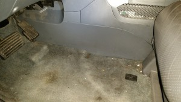
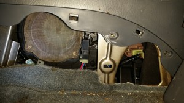
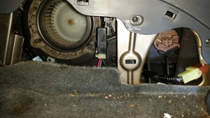
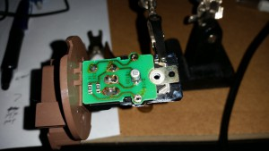
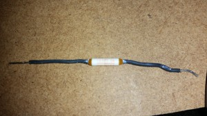

+++
title = "Fixing Inoperative Rear Vent in Honda Pilot"
date = 2015-04-12T21:57:32
draft = false
categories = ["Electronics"]
slug = "fixing-inoperative-rear-vent-in-honda-pilot"
aliases = ["/2015/04/fixing-inoperative-rear-vent-in-honda-pilot/"]
+++

Haven’t had much time for any projects over the last year or so. Having a new baby in the house tends to do that. Now that she is a little older and on a good schedule, I might be able to get a little time to work on some projects.

My wife drives a 2005 Honda Pilot. Recently, we discovered that the rear vents for the second row of seats were not blowing any air. Of course, this makes the kids uncomfortable and Kimberly kept complaining that her back was sweaty. I hadn’t really looked into it too much so Carrie did some searching and came across <a href="http://www.themafamily.net/2011/11/22/fixing-my-pilots-rear-heater-vents" target="_blank">this blog</a>. The short version is that the screen over the blower gets clogged with dust and a thermal fuse goes open circuit permanently.

The rear vents in question

I took the pictures as I was putting everything back together (didn’t think to take them as I was taking everything apart). Everything is hidden behind the kick panel at the bottom of the center console on the driver’s side. Slide the seat all the way back to expose the entire panel.

Kick panel at the bottom of the center console, driver’s side

As in most automotive panels where you don’t see any obvious screws, this is held in place by clips that just need to be popped out. I was able to slide my fingers underneath against the floor and it popped out after pulling for a bit. This exposes the blower, relay and transistor assembly.

Left to right: Blower intake (grey), relay (black), transistor assembly (brown)

If you’ve never gone in here before, you’ll probably see a ton of dust covering the blower intake. The picture shows what it looks like when it is clean. You can take a vaccum to it from here, but I opted to remove the intake screen to get it really clean. You can see two screws in the picture that you need to remove. There is also one hidden under the upper panel at the top of the screen. This also helps to see if the blower is moving or not.

Blower exposed

On the right hand side of the above picture, you’ll see a circular brown assembly with the wires disconnected. There’s a release at the bottom of the plug that has to be pressed to remove the plug. There are two screws on either side of the plug to be removed. Then you need to rotate the assembly clockwise while pressing on the black tab at the bottom. There are notches in the assembly that need to line up with the black tabs holding the assembly in place in order to pull the assembly out. Remove the top of the assembly to expose the circuit board.

Circuit board with thermal fuse desoldered

With the assembly oriented as shown above, remove the screw on the right to separate the circuit board from the heat sink. At the top and bottom of the picture, the two solder points closest to the right edge connect to a thermal fuse on the other side of the circuit board. Before I went any further, I wanted to be sure that the thermal fuse was the issue. I soldered a jumper wire between the two solder points mentioned and plugged it in for a quick test. The blower sprung to life, so I was certain that the fuse was permanently blown.

The offending thermal fuse

I desoldered the thermal fuse and removed it. It sits on the oposite side of the circuit board mounted right above the transistor. Be ready to deal with some thermal grease. The fuse is rated at 133 degrees Celcius, 2 amps. I went to the local Fry’s to find a replacement. The closest I could find was 117 degrees at 15 amps. I bit overkill on the amps (and added some bulk to the fuse making it nearly impossible to reinstall correctly. For anyone else doing this, I would recommend <a href="http://www.digikey.com/product-search/en?WT.z_header=search_go&amp;lang=en&amp;site=us&amp;keywords=P10921-ND&amp;x=0&amp;y=0" target="_blank" title="Digikey Part P10921-ND">something like this</a> instead.

Before putting the assembly back together, I cleaned off the old thermal grease and applied new grease (also got the cheap Thermaltake grease meant for computer CPUs so it should hold up well). As they say in the manuals, installation is the reverse of the removal. After putting everything back together, we now have a lot of air moving into the second row seats again. Better than when we bought the car in 2010.
