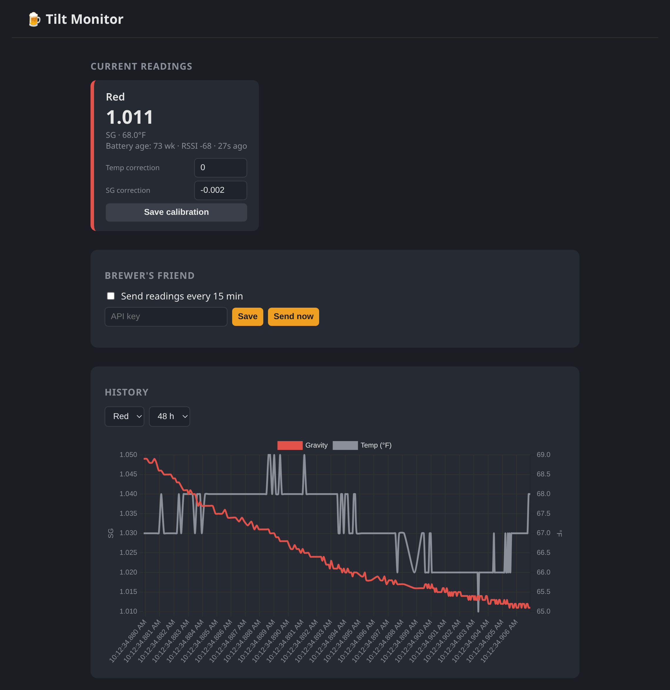

I brew beer, and for the last few years I've tracked fermentation with a
[Tilt Hydrometer](https://tilthydrometer.com/) — a battery-powered sensor that
floats in the fermenter and broadcasts the current temperature and specific
gravity over Bluetooth Low Energy. Watching gravity fall over a week or two is
the easiest way to know fermentation is actually happening and when it's done.

The catch with the Tilt is that *something* has to be in BLE range, always
listening, to capture those readings and do anything useful with them. For years
that something was a pair of scripts I wrote running on a Raspberry Pi next to my
fermentation fridge. They worked, but using them had become a genuine chore. So
I tore the whole thing down and rebuilt it as a single Dockerized service with a
web interface. The result is [`tilt-monitor`](https://github.com/mjlocat/tilt-monitor),
and along the way I got to chase down a battery-age mystery and figure out why my
Bluetooth mouse suddenly stopped working.

## The old setup, and why it had to go

The original system was two separate projects:

- **tilt2db** scanned for the Tilt's BLE advertisements and wrote each reading
  into a MySQL database.
- **tilt2bf** read the last 15 minutes of readings back out of MySQL, averaged
  them, and pushed the result to [Brewer's Friend](https://www.brewersfriend.com/)
  so I could see graphs alongside my recipe.

Both ran from cron. Starting a brew looked like this: power on the Pi, start the
root cron job for the scanner, wait for a reading to land, go query the database
by hand to see the raw numbers, edit a YAML config file to fix the calibration
offset if gravity was reading high or low, then start the *second* cron job for
the Brewer's Friend uploader. Every single batch. And if I forgot a step, I'd
discover it days later as a gap in the graph.

There were two deeper problems too. First, the scanner depended on a *custom
fork* of a BLE library (`aioblescan`) that I had to install from a zip file
because the version on PyPI didn't expose what I needed. When I tried to move the
whole thing to a newer machine, that fork wouldn't build cleanly, and I lost an
evening to it. Second, a full MySQL server is wildly overkill for "store a few
numbers every few seconds for one person."

I wanted one thing I could `docker compose up` anywhere with a working Bluetooth
stack, that ran whether or not I was actively brewing, and that I could check and
adjust from a browser.

## The new shape

`tilt-monitor` is a single [FastAPI](https://fastapi.tiangolo.com/) process that
does everything the two old scripts did, plus a web dashboard, in one container:

- A background task scans for Tilt advertisements and stores readings in a
  local **SQLite** file — no database server.
- Another background task averages the last 15 minutes per color and posts to
  Brewer's Friend, but only when I've toggled it on.
- The web UI shows live temperature, gravity, and battery status for each Tilt
  color it sees, draws historical graphs, lets me set calibration offsets right
  in the browser, and has a single switch to start or stop sending data to
  Brewer's Friend.


*The dashboard mid-fermentation: a live reading card with in-browser
calibration, the Brewer's Friend switch, and the gravity/temperature history
graph. (Shown with representative sample data.)*

The custom BLE library is gone. The new scanner uses [bleak](https://github.com/hbldh/bleak),
which is cross-platform, actively maintained, and talks to the host's BlueZ
stack over D-Bus. Pure `pip install`, no zip files, no compiling. That alone
solved the portability headache.

A Tilt advertises as an Apple iBeacon, so decoding a reading is just pulling the
manufacturer-specific data out of the advertisement and slicing it up:

```python
APPLE_COMPANY_ID = 0x004C  # Tilt broadcasts as an Apple iBeacon

def decode_tilt(manufacturer_data, rssi, mac):
    payload = manufacturer_data.get(APPLE_COMPANY_ID)
    if not payload or len(payload) < 23 or payload[0] != 0x02:
        return None
    uuid = payload[2:18].hex()          # identifies the Tilt's color
    major = int.from_bytes(payload[18:20], "big")   # temperature, °F
    minor = int.from_bytes(payload[20:22], "big")   # specific gravity ×1000
    tx_power = payload[22]               # see the battery saga below
    ...
```

### One small design decision I'm happy about

The old code applied the calibration offset *before* storing the reading. That
meant if you got the calibration wrong, every historical reading was already
baked with the bad offset and there was no fixing the graph after the fact.

The new service stores the **raw** reading and applies calibration when the data
is read back, on the fly. Change a correction in the UI and the entire history
re-renders with the new offset. It costs nothing and it means I can dial in
calibration after the fact instead of getting one shot at it before the batch
starts.

## The battery that read negative fifty-nine weeks

With the dashboard up and a Tilt nearby, almost everything looked right — except
the battery status, which flipped back and forth between "73 weeks" and
"-59 weeks" every few seconds.

Negative fifty-nine weeks is obviously wrong, and the flickering was the clue.
The Tilt encodes "weeks since the battery was changed" in that last `tx_power`
byte of the iBeacon. Two things were going on:

1. **I was reading the byte as signed.** The value `197` (which is `0xC5`) read
   as a signed 8-bit integer is `-59`. Reading it unsigned gives the real `197`.
2. **The Tilt alternates between two advertisement packets.** One carries the
   real battery age in that byte; the other carries a fixed sentinel value of
   `197`. Both have valid temperature and gravity, which is why only the battery
   number flickered — and my code was happily displaying whichever packet
   arrived most recently.

The fix was to read the byte unsigned, treat anything above the documented
maximum of 152 weeks as "not a battery reading," and have the dashboard show the
most recent *valid* value so it stops bouncing:

```sql
SELECT tx_power FROM readings
WHERE color = ? AND tx_power BETWEEN 0 AND 152
ORDER BY ts DESC LIMIT 1
```

Now it sat at a steady **73 weeks**. Which raised a better question: is that
number even believable?

Here's where it got fun. I've had this Tilt since around my 12th batch, on April
10, 2022 — call it four years and roughly 218 *calendar* weeks ago. If the
counter ran on wall-clock time it would have pegged at its 152-week maximum long
ago. It hadn't. So the counter must only advance while the device is actually
awake and beaconing in a fermenter, not while it sits in a drawer between brews.

And the math backs that up beautifully. Twenty-something batches since I got it,
at a two-week base fermentation with the occasional three- or four-week lager,
lands right around 73 weeks of *active* time. The number isn't a charge gauge at
all — it's an odometer for how long the cell has been powered on.

The Tilt runs on a **CR123A**. Seventy-three weeks of continuous
beaconing on the original battery is entirely reasonable for a CR123A.
Mystery solved, and now I know roughly how much runtime I've actually used.

## The Bluetooth mouse that wouldn't connect

The other surprise showed up the moment the scanner started running: my
Bluetooth mouse stopped connecting.

This one isn't a bug so much as physics. The machine has a single Bluetooth
radio, and that radio has to time-share between *scanning* for advertisements and
*connecting* to devices. The default scanning mode is **active** scanning, which
also transmits scan-request packets, and running it continuously leaves almost no
airtime for the adapter to establish a new connection. The mouse simply never got
a turn.

The right fix is conceptually simple: a Tilt is a pure broadcaster. I never
connect to it — I only listen. That's exactly what **passive** scanning is for.
Passive scanning doesn't transmit anything and can offload filtering to the
controller, so it's dramatically friendlier to other devices sharing the radio.

The complication is that passive scanning on Linux uses BlueZ's
`AdvertisementMonitor` D-Bus interface, and even on a current BlueZ (5.82, on
Debian 13) that interface is still gated behind experimental features and off by
default. I confirmed it was missing on my system by introspecting the adapter
over D-Bus:

```sh
busctl introspect org.bluez /org/bluez/hci0 | grep AdvertisementMonitorManager1
# (no output — the interface isn't exposed)
```

Enabling it is one line in `/etc/bluetooth/main.conf`:

```ini
[General]
Experimental = true
```

followed by `sudo systemctl restart bluetooth`. (There's an equivalent systemd
drop-in approach that passes `-E` to `bluetoothd` if you'd rather not touch
`main.conf` — you only need one or the other.) After that the interface appears,
passive scanning works, and the mouse behaves. If you'd rather not enable
experimental features at all, the bulletproof alternative is a second cheap USB
Bluetooth dongle dedicated to the Tilt, leaving the built-in radio free.

## Running it as a well-behaved container

The old scanner had to run as **root** because the custom library opened a raw
HCI socket directly. The bleak rewrite changed that calculus: now the privileged
Bluetooth work is done by the host's `bluetoothd`, and the container just talks to
it over D-Bus. The application itself opens no raw sockets and writes nothing but
its own database file.

So there's no reason for it to run as root, and it doesn't. The image creates a
dedicated unprivileged user and switches to it. The one wrinkle is that on Debian,
D-Bus policy only lets `root` or members of the `bluetooth` group talk to
`org.bluez`, so the container has to join that group:

```yaml
services:
  tilt-monitor:
    network_mode: host          # so bleak can reach BlueZ
    group_add:
      - "${BLUETOOTH_GID:-112}" # host 'bluetooth' group: getent group bluetooth
    volumes:
      - ./data:/data            # SQLite lives here
      - /var/run/dbus:/var/run/dbus
```

Host networking plus the system D-Bus socket plus that one group membership is
the whole recipe for BLE in a non-root container. No `--privileged`, no extra
capabilities.

## Where it landed

Starting a brew now means... nothing. The service is always running. I drop the
Tilt in the fermenter, open the dashboard, watch the numbers, and flip the
Brewer's Friend toggle on if I want the data mirrored there. Calibration is a
text box I can adjust whenever, not a config file I edit before it's too late to
matter. And when I inevitably set this up on a different machine someday, it's a
`docker compose up` instead of an evening of fighting a library that won't build.

It's a small project, but it's the kind that pays for itself every batch — and I
learned more about the Tilt's advertisement format and the
realities of sharing one Bluetooth radio than I ever expected to.

The code is on [GitHub](https://github.com/mjlocat/tilt-monitor), and a prebuilt
multi-arch image (amd64, arm64, and armv7) lives on
[Docker Hub](https://hub.docker.com/r/mjlocat/tilt-monitor) — so on a Raspberry Pi
it really is a single `docker compose up`. Grab it if you've got a Tilt and a Pi
looking for a job.
