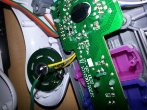
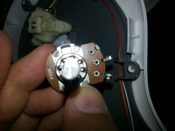
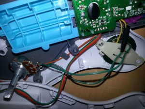
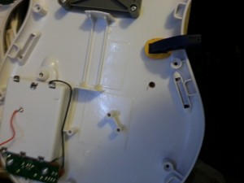
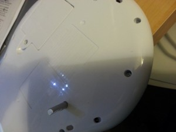

+++
title = "Turning the Volume Down"
date = 2013-11-11T21:41:38
draft = false
categories = ["Electronics"]
slug = "turning-the-volume-down"
aliases = ["/2013/11/turning-the-volume-down/"]
+++

I finally started a blog. I’m going to chronicle my exploration of amateur (ham) radio and electronics. So, let’s get to the first post.

For the first post, I decided to go after something simple. My daughter has an Elmo guitar, the volume of which is, shall we say, earsplitting. I’ve been threatening to wire a potentiometer into the thing so it isn’t so loud. (for those that don’t know, a potentiometer resists the flow of electricity and has a knob to change the amount of resistance).

Here, we see the speaker. I’m just going to clip one of the wires off and wire that to one side of the potentiometer.

This is the potentiometer. It’s a 50k ohm audio taper. In hindsight, a 10k ohm would probably have been better, but this was the only audio taper I had.The shaft is also a couple of inches longer than I would have liked.

Here, I’ve wired two of the terminals of the potentiometer, one to the wire that was clipped off and one to the speaker.

Now to make a place for the shaft of the potentiometer. A clamp, a block of wood, and a drill made quick work of it. Well, would have if I picked the right size drill bit the first time around.

Finally, put it all together. Yes, it’s ugly, but it’s functional.

What I would do next time: either get a better potentiometer and put a knob on it, or better yet, determine what value resistor would give a good volume and just use that. The latter has the advantage that the kid won’t go turning it back up to 11.
